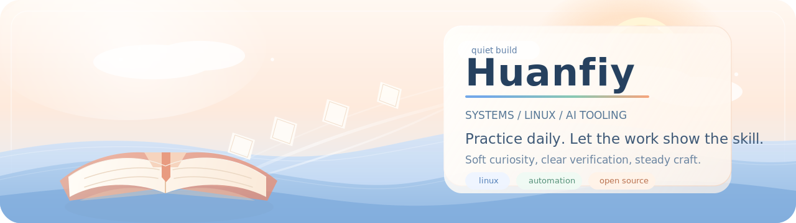

  

  
  
  
  

<h3 align="center">把兴趣做成作品，把想法磨成能落地、能验证的东西。</h3>

  Systems · Linux workflows · AI tooling · automation · open-source experiments

  把手上的事做好，把本事留在作品里。

## Profile Notes

<table>
  <tr>
    <td width="50%" valign="top">
      <h3>Public Notes</h3>
      

        这里只放公开、稳定、非敏感的信息。
         
        比起即时状态，更偏向留下能长期成立的判断和作品。
      

    </td>
    <td width="50%" valign="top">
      <h3>Focus</h3>
      

        系统思维 / Linux / AI 工具链 / 自动化 / 代码阅读 / 工程验证
      

    </td>
  </tr>
  <tr>
    <td width="50%" valign="top">
      <h3>How I Work</h3>
      

        先理解问题本身，再做工程取舍。
         
        偏好边界清晰、步骤可验证、结果可复用的解法。
      

    </td>
    <td width="50%" valign="top">
      <h3>Daily Setup</h3>
      

        Ubuntu 22.04
         
        zsh / Git / terminal-first workflow
      

    </td>
  </tr>
</table>

## Working Principles

- 先理解本质，再优化表面。
- 先把东西做出来，再用可观察的方法验证它。
- 偏好可复用的工具，而不是一次性的聪明技巧。
- 让作品替自己说话。

## Toolbox

  

## Open Source Snapshot

  
  

  

  Keep the signal high. Practice daily. Let the work answer.

