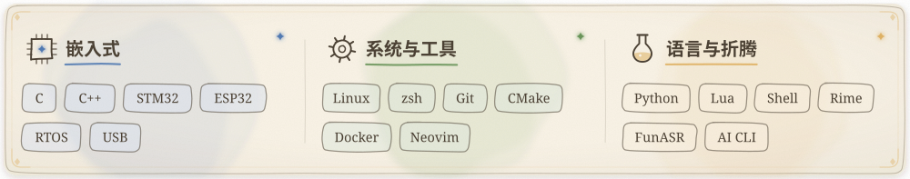
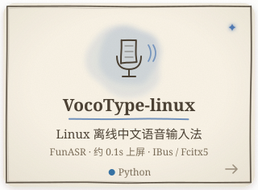
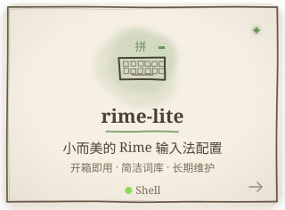
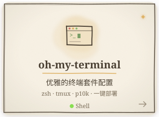
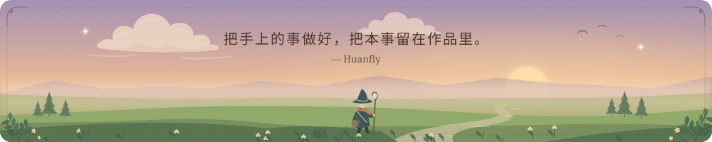

<!-- 横幅由 huanfly.com 动态生成：随北京时间在黎明/白天/黄昏/夜晚间切换 -->

  

<picture>
  <source media="(prefers-color-scheme: dark)" srcset="./assets/h-about-dark.svg" />
  
</picture>

<!-- 素材位：由 huanfly.com/gh/keyart 提供，未放图时显示原创插画 -->

个人开发者，AI 技术狂热研究中。

当下的开发理念：简洁、优雅，做减法。

喜欢清新自然，又可爱的事物。

<picture>
  <source media="(prefers-color-scheme: dark)" srcset="./assets/tags-dark.svg" />
  
</picture>

 

<picture>
  <source media="(prefers-color-scheme: dark)" srcset="./assets/h-stack-dark.svg" />
  
</picture>

<picture>
  <source media="(prefers-color-scheme: dark)" srcset="./assets/h-works-dark.svg" />
  
</picture>

  
  
  

<picture>
  <source media="(prefers-color-scheme: dark)" srcset="./assets/h-stats-dark.svg" />
  
</picture>

 

  
    插画为原创手绘风 SVG，随北京时间昼夜流转 · 文字使用 <a href="https://github.com/lxgw/LxgwWenKai">霞鹜文楷</a> · 动态卡片由 <a href="https://huanfly.com">huanfly.com</a> 实时渲染
  

